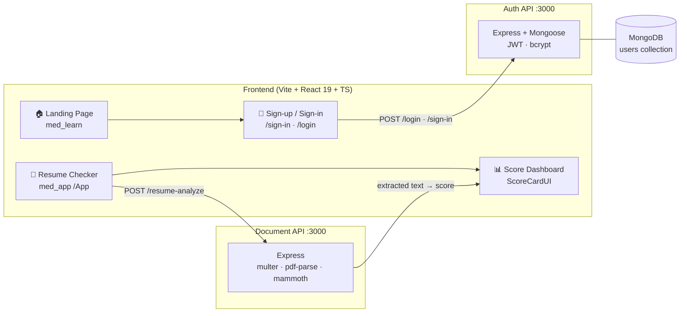

<div align="center">

<!-- ============ ANIMATED HEADER ============ -->


**A full-stack, ATS-powered resume analyzer that scores your resume out of 100, breaks down
exactly what recruiters and applicant tracking systems look for, and tells you what to fix.**


</div>

---

## 📑 Table of Contents

- [About](#-about)
- [Key Features](#-key-features)
- [Architecture](#%EF%B8%8F-architecture)
- [Project Structure](#-project-structure)
- [Tech Stack](#-tech-stack)
- [Getting Started](#-rocket-getting-started)
- [API Reference](#-api-reference)
- [Environment Variables](#%EF%B8%8F-environment-variables)
- [Roadmap](#-roadmap)
- [Known Limitations](#-warning-known-limitations)
- [Contributing](#-contributing)
- [Author](#-author)

---

## 🎯 About

**AI Resume Checker** is a monorepo containing three tightly coupled modules:

| Module | What it does |
| :---: | --- |
| `med_learn` | The public **landing site + auth** — a dark, animated marketing page, sign-up and sign-in flows. |
| `med_app` | The **resume checker app** — drag-in upload box, client-side validation, and a score dashboard. |
| `App-Backend` | The **document engine** — extracts raw text from PDF/DOCX uploads with `pdf-parse` and `mammoth`. |

Upload a resume → the AI scans ATS compatibility, keywords, structure and clarity →
you get an **instant score out of 100** with a section-wise breakdown, a list of issues,
a written verdict, and company suggestions.

---

## ✨ Key Features

### 🏠 Landing Page (`med_learn/frontend`)
- **Scroll-reveal animations** powered by `IntersectionObserver` — no animation library needed
- **Glassmorphism fixed navbar** that gains a border/blur state once you scroll past 24px
- Gradient hero, feature grid, live stat cards and a glowing CTA banner
- **"How It Works" & "Before You Upload"** guide cards with custom ✅ checklist bullets
- Smooth in-page scrolling and fully responsive down to mobile
- **Zero external UI libraries** — every pixel is handcrafted CSS

### 🔐 Authentication (`med_learn/backend`)
- **Sign-up** with username, email & password — hashed with **bcrypt** (10 salt rounds)
- **Sign-in** that returns a **JWT** (1 hour expiry)
- Duplicate detection on unique `username` / `email` (Mongo `11000` → `409`)
- Passwords never returned — queries use `.select('-password')`
- `verifyToken` middleware ready to guard protected routes

### 📄 Resume Checker (`med_app`)
- **Upload box** for PDF / DOC / DOCX with a shine-sweep hover effect
- **Client-side 5MB guard** before anything hits the network
- Selected-file preview + "Analyse Resume" action button
- **Score dashboard**:
  - 💧 Animated **WaterTank** gauge for the overall score
  - 5-category **breakdown bars** — ATS, Keywords, Impact, Formatting, Clarity
  - **Issues Found** list
  - Written **Verdict**
  - **Company Suggestion** chips

### ⚙️ Document Engine (`App-Backend`)
- `multer` multipart uploads (streamed to `uploads/`)
- **PDF → text** via `pdf-parse`, **DOCX → text** via `mammoth`
- Graceful `400` for unsupported MIME types, `500` on parse failures
- CORS-enabled for the Vite dev servers

---

## 🗺️ Architecture



> **Flow:** Landing → create account → sign in → upload resume → text extraction →
> AI scoring → visual report → apply fixes → re-upload to track improvement.

---

## 📁 Project Structure

```
AI Resume/
│
├── 📄 README.md                     ← you are here
│
├── med_learn/                        # Landing site + authentication
│   ├── frontend/                     # React 19 + TypeScript + Vite
│   │   └── src/
│   │       ├── Pages/
│   │       │   ├── home.tsx          # Animated marketing page
│   │       │   ├── login.tsx         # Sign-up form
│   │       │   └── signIn.tsx        # Sign-in form (JWT)
│   │       ├── styles/               # home.css · login.css · signIn.css
│   │       └── App.tsx               # Router: / · /sign-in · /login
│   └── backend/                      # Express + Mongoose + JWT
│       ├── dataSchema/userSchema.js
│       └── server.js                 # :3000
│
├── med_app/                          # The resume checker application
│   └── src/
│       ├── pages/app1.tsx            # Upload flow + validation
│       ├── components/scoreCard.tsx  # WaterTank gauge + report UI
│       ├── Styles/                   # AIResume.css · ScoreCard.css
│       └── App.tsx                   # Route: /App
│
└── App-Backend/                      # Document extraction service
    └── server.js                     # :3000 · pdf-parse · mammoth · multer
```

---

## 🛠️ Tech Stack

| Layer | Technology |
| --- | --- |
| **Frontend** | React 19, TypeScript 6, Vite 8, React Router 7 |
| **Styling** | Handcrafted CSS — CSS variables, grid, `backdrop-filter`, keyframes, `IntersectionObserver` |
| **Backend** | Node.js, Express 5 (ESM) |
| **Database** | MongoDB via Mongoose 9 |
| **Auth** | JSON Web Tokens, bcryptjs |
| **Documents** | multer, pdf-parse, mammoth |
| **Quality** | ESLint 10, typescript-eslint, `tsc --noEmit` |

---

## 🚀 Getting Started

### Prerequisites
- **Node.js** ≥ 18 (with npm)
- **MongoDB** — a local instance or an Atlas connection string

### 1️⃣ Clone

```bash
git clone https://github.com/Lavish09_Mehra/ai-resume-checker.git
cd ai-resume-checker
```

### 2️⃣ Auth backend (`med_learn/backend`)

```bash
cd med_learn/backend
npm install
```

Create a `.env` file:

```env
MONGO_URL=mongodb://localhost:27017/ai-resume
JWT_SECRET=super-secret-change-me
```

```bash
npm start          # → http://localhost:3000
```

### 3️⃣ Landing frontend (`med_learn/frontend`)

```bash
cd med_learn/frontend
npm install
npm run dev        # → http://localhost:5173
```

### 4️⃣ Document backend (`App-Backend`)

```bash
cd App-Backend
npm install
npm start          # → http://localhost:3000
```

### 5️⃣ Resume checker app (`med_app`)

```bash
cd med_app
npm install
npm run dev        # → http://localhost:5174
```

<details>
<summary>📦 <b>All scripts</b></summary>

| Command | Where | Description |
| --- | --- | --- |
| `npm run dev` | `med_learn/frontend`, `med_app` | Start Vite dev server w/ HMR |
| `npm run build` | `med_learn/frontend`, `med_app` | `tsc -b && vite build` production build |
| `npm run lint` | `med_learn/frontend`, `med_app` | ESLint |
| `npm start` | `med_learn/backend`, `App-Backend` | Start Express server |

</details>

---

## 📡 API Reference

### `App-Backend` — Document Engine

| Method | Endpoint | Body | Success | Description |
| --- | --- | --- | --- | --- |
| `GET` | `/` | — | `200` | Health check |
| `POST` | `/resume-analyze` | `multipart` field `resume` | `200` | Receives the resume file |
| `POST` | `/resume-extract` | `multipart` field `resume` | `200` `{ text }` | Extracts raw text (PDF/DOCX) |

**Errors:** `400` no file / unsupported type · `500` parse failure

### `med_learn/backend` — Auth API

| Method | Endpoint | Body | Success | Description |
| --- | --- | --- | --- | --- |
| `POST` | `/login` | `username`, `email`, `password` | `200` | Creates an account (password bcrypt-hashed) |
| `POST` | `/sign-in` | `username`, `password` | `200` `{ token }` | Returns a JWT (1h) + public user |
| `GET` | `/user-data` | — | `200` | Lists users **without** passwords |

**Errors:** `400` missing fields · `401` bad credentials · `409` duplicate user · `500` server error

---

## 🔐 Environment Variables

`med_learn/backend/.env`

| Key | Required | Purpose |
| --- | --- | --- |
| `MONGO_URL` | ✅ | MongoDB connection string |
| `JWT_SECRET` | ✅ | Secret used to sign/verify tokens |

> ⚠️ Never commit `.env` — keep it out of git.

---

## 📈 Roadmap

- [ ] Wire `/resume-extract` → real AI scoring pipeline (LLM/keyword analysis)
- [ ] Connect `ScoreCardUI` to live results instead of sample data
- [ ] Persist analysis history per user and show score-over-time trends
- [ ] PDF download / shareable report link
- [ ] Real drag-and-drop + drop-zone highlight (`.drag-over` is already styled)
- [ ] Route protection with `verifyToken` middleware on the frontend
- [ ] Deploy frontends (Vercel) and backends (Render) with CORS allow-list

---

## ⚠️ Known Limitations

- **Port collision** — both Express servers bind to `3000`. Run **one at a time**, or move
  one to another port and update the `fetch` URLs in `app1.tsx`.
- The score dashboard currently renders **sample data**; the AI scoring step isn't connected yet.
- `.env` values are required or the auth server will not start.

---

## 🤝 Contributing

Contributions, issues and feature requests are welcome!

1. Fork the repository
2. Create your branch — `git checkout -b feature/awesome-thing`
3. Commit your changes — `git commit -m "Add awesome thing"`
4. Push — `git push origin feature/awesome-thing`
5. Open a Pull Request

---

## 👤 Author

<div align="center">


### **Lavish Mehra**
*Full-Stack Developer · Building AI-powered tools*

[](https://github.com/Lavish09_Mehra)
[](https://www.linkedin.com/in/lavish09dev)
[](https://github.com/Lavish09_Mehra)

*If you found this helpful, drop a ⭐ on the repo — it really helps!*

</div>

---

<div align="center">


**© 2026 AI Resume Checker — Made with ❤️ and a lot of ☕**

</div>
