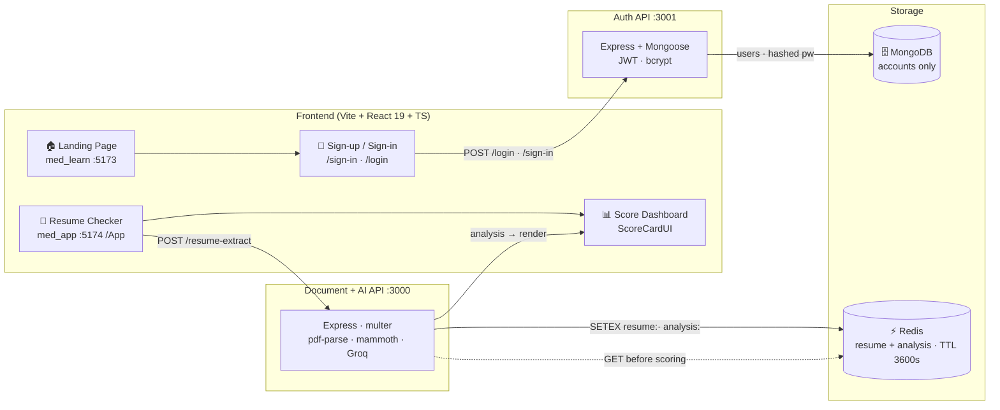

<div align="center">

<!-- ============ ANIMATED HEADER ============ -->


**A full-stack **MERN** (MongoDB · Express · React · Node) ATS-powered resume analyzer that scores
your resume out of 100, breaks down exactly what recruiters and applicant tracking systems look for,
and tells you what to fix.**

> ### 🔐 Your resume is stored in **Redis** — never in MongoDB
> Extracted text and AI analysis live in **Redis** with a **1-hour TTL**, so the document stays
> out of the primary database, expires on its own, and is purged automatically.
> MongoDB is used **only** for user accounts.


</div>

---

## 📑 Table of Contents

- [About](#-about)
- [Key Features](#-key-features)
- [Architecture](#%EF%B8%8F-architecture)
- [Project Structure](#-project-structure)
- [Tech Stack](#-tech-stack)
- [Getting Started](#-rocket-getting-started)
- [API Reference](#-api-reference)
- [Environment Variables](#%EF%B8%8F-environment-variables)
- [Security](#-security)
- [Roadmap](#-roadmap)
- [Known Limitations](#-warning-known-limitations)
- [Troubleshooting](#-troubleshooting)
- [Contributing](#-contributing)
- [Author](#-author)

---

## 🎯 About

**AI Resume Checker** is a monorepo of four cooperating parts:

| Module | Port | What it does |
| :---: | :---: | --- |
| `med_learn/frontend` | `5173` | **Landing site + auth UI** — dark animated marketing page, sign-up & sign-in. |
| `med_learn/backend` | `3001` | **Auth API** — bcrypt passwords, JWT sign-in, MongoDB user records. |
| `med_app` | `5174` | **Resume checker app** — upload box, validation, live score dashboard at `/App`. |
| `App-Backend` | `3000` | **Document + AI engine** — PDF/DOCX extraction, Groq scoring, Redis storage. |

**How it works:** upload a resume → text is extracted → stored in Redis → the AI scores ATS
compatibility, keywords, structure and clarity → you get an **instant score out of 100** with a
section-wise breakdown, a list of issues, missing-information alerts, ranked fixes, a written
verdict, and company suggestions.

### 🔐 Data Storage Design

Storage is deliberately split so sensitive documents never land in the primary database:

| Data | Store | Why |
| :---: | :---: | --- |
| Accounts — username, email, bcrypt-hashed password | **MongoDB** | Small durable records that must persist |
| **Resume text + AI analysis** | **Redis** | In-memory, **TTL `3600`**, evicted automatically |

> ⚠️ **Resume data is never written to MongoDB.** It goes to Redis, expires on its own after
> one hour, and never becomes a permanent row in the user database.

---

## ✨ Key Features

### 🏠 Landing Page (`med_learn/frontend`)
- **Scroll-reveal animations** powered by `IntersectionObserver` — no animation library needed
- **Glassmorphism fixed navbar** that gains a border/blur state once you scroll past 24px
- Gradient hero, feature grid, live stat cards and a glowing CTA banner
- **"How It Works" & "Before You Upload"** guide cards with custom ✅ checklist bullets
- Fully responsive down to mobile — **zero external UI libraries**, every pixel is handcrafted CSS

### 🔐 Authentication (`med_learn/backend`)
- **Sign-up** with username, email & password — hashed with **bcrypt** (10 salt rounds)
- **Sign-in** returns a **JWT** (1 hour expiry), stored in `sessionStorage`
- Duplicate detection on unique `username` / `email` (Mongo `11000` → `409`)
- Passwords never returned — queries use `.select('-password')`
- Successful auth redirects straight to the dashboard at `/App`

### 📄 Resume Checker (`med_app`)
- **Upload box** for PDF / DOC / DOCX with a shine-sweep hover effect
- **Client-side 5MB guard** before anything hits the network
- Loading spinner, inline error states, and payload validation via `isResumeAnalysis()`
- **Score dashboard**:
  - 💧 Animated **WaterTank** gauge for the overall score
  - 5-category **breakdown bars** — ATS, Keywords, Impact, Formatting, Clarity
  - **Resume Strengths** · **Issues Found** · **Missing Information**
  - **Improvement Suggestions** with a ranked **Top 3 Fixes**
  - Written **Verdict** and **Company Suggestion** chips

### ⚙️ Document + AI Engine (`App-Backend`)
- `multer` multipart uploads, then **PDF → text** (`pdf-parse`) or **DOCX → text** (`mammoth`)
- **Groq** scoring with strict JSON-schema output → 8-field typed analysis
- **🔐 Resumes stored in Redis** (`resume:<uuid>`, `analysis:<uuid>`) with a **1 hour TTL**
- Graceful `400` for unsupported MIME types, `500` on parse/AI failure, `503` if Redis is down

---

## 🗺️ Architecture



> **Flow:** Landing → create account → sign in → upload resume → extract text →
> `SETEX` into Redis → AI reads it back and scores → analysis cached in Redis →
> report renders → Redis auto-expires everything after 1 hour.

---

## 📁 Project Structure

```
AI Resume/
│
├── README.md                        ← you are here (single global README)
├── .gitignore                       ← global; excludes .env, uploads/, secrets
│
├── med_learn/                       # Landing site + authentication
│   ├── frontend/                    # React 19 + TS + Vite           (:5173)
│   │   └── src/
│   │       ├── Pages/
│   │       │   ├── home.tsx         # Animated marketing page
│   │       │   ├── login.tsx        # Sign-up  → redirects to /App
│   │       │   └── signIn.tsx       # Sign-in  → redirects to /App + saves JWT
│   │       ├── styles/              # home.css · login.css · signIn.css
│   │       └── App.tsx              # Router: / · /sign-in · /login
│   └── backend/                     # Auth API                        (:3001)
│       ├── dataSchema/userSchema.js # Mongoose user model
│       ├── .env.example             # MONGO_URL, JWT_SECRET template
│       └── server.js                # /login · /sign-in · /user-data
│
├── med_app/                         # The resume checker application
│   └── src/
│       ├── pages/app1.tsx           # Upload flow, fetch, loading/error state
│       ├── components/scoreCard.tsx # WaterTank gauge + full report UI
│       ├── types/analysis.ts        # TS interfaces + isResumeAnalysis() guard
│       ├── Styles/                  # AIResume.css · ScoreCard.css
│       └── App.tsx                  # Route: /App
│
└── App-Backend/                     # Document + AI engine           (:3000)
    ├── server.js                    # Express entry, mounts routers
    ├── redis.js                     # Redis client + error logging
    ├── AiLayer.js                   # Groq scoring (JSON schema)
    ├── .env.example                 # GROQ_KEY, MONGO_API template
    ├── Routing/
    │   ├── extract.js               # POST /resume-extract  ← real pipeline
    │   └── analyze.js               # POST /resume-analyze   (stub)
    └── Schema/ResumeSchema.js
```

---

## 🛠️ Tech Stack

| Layer | Technology |
| --- | --- |
| **Stack** | **MERN** — MongoDB · Express · React · Node.js |
| **Frontend** | React 19, TypeScript 6, Vite 8, React Router 7 |
| **Styling** | Handcrafted CSS — variables, grid, `backdrop-filter`, keyframes, `IntersectionObserver` |
| **Backend** | Node.js, Express 5 (ESM) |
| **User DB** | MongoDB via Mongoose 9 — accounts only |
| **Resume store** | **Redis** (`redis@4`) — in-memory + TTL, resumes kept **out** of MongoDB |
| **Auth** | JSON Web Tokens, bcryptjs |
| **Documents** | multer, pdf-parse, mammoth |
| **AI** | Groq (`openai/gpt-oss-20b`) with strict JSON-schema output |
| **Quality** | ESLint 10, typescript-eslint, `tsc --noEmit` |

---

## 🚀 Getting Started

### Prerequisites
- **Node.js** ≥ 18 (with npm)
- **MongoDB** — local instance or Atlas connection string *(user accounts only)*
- **Redis** — local service on `6379` *(stores resumes, not MongoDB)*

### 1️⃣ Clone

```bash
git clone https://github.com/Lavish09-Mehra/ai-resume-checker.git
cd ai-resume-checker
```

### 2️⃣ Auth backend → `med_learn/backend`

```bash
cd med_learn/backend
npm install
cp .env.example .env        # then fill in real values
npm start                   # → http://localhost:3001
```

### 3️⃣ Landing frontend → `med_learn/frontend`

```bash
cd med_learn/frontend
npm install
npm run dev                 # → http://localhost:5173
```

### 4️⃣ Document + AI backend → `App-Backend`

```bash
cd App-Backend
npm install
cp .env.example .env        # then fill in GROQ_KEY
npm start                   # → http://localhost:3000
```

### 5️⃣ Resume checker app → `med_app`

```bash
cd med_app
npm install
npm run dev                 # → http://localhost:5174/App
```

> ✅ All four can run **at the same time** — the backends use `3000` / `3001`
> and Vite pins `5173` / `5174` with `strictPort`.

<details>
<summary>📦 <b>All scripts</b></summary>

| Command | Where | Description |
| --- | --- | --- |
| `npm run dev` | `med_learn/frontend`, `med_app` | Vite dev server with HMR |
| `npm run build` | `med_learn/frontend`, `med_app` | `tsc -b && vite build` production build |
| `npm run lint` | `med_learn/frontend`, `med_app` | ESLint |
| `npm start` | `med_learn/backend`, `App-Backend` | Start the Express server |

</details>

---

## 📡 API Reference

### `App-Backend` — Document + AI Engine · `:3000`

| Method | Endpoint | Body | Success | Description |
| --- | --- | --- | --- | --- |
| `GET` | `/` | — | `200` `I am UP` | Health check |
| `POST` | `/resume-extract` | `multipart` field `resume` | `200` | **The real pipeline** — extract → Redis → AI → Redis |
| `POST` | `/resume-analyze` | `multipart` field `resume` | `200` | Stub — accepts the file and echoes `{ message }` |

**`POST /resume-extract` response**

```jsonc
{
  "message": "Resume Text Successfully Extracted",
  "analysis": { /* 8 fields: overallScore, scoreBreakdown, resumeStrengths,
                   issues, missingInformation, improvementSuggestions,
                   verdict, companySuggestions */ },
  "resumeId": "2549bd76-8b65-4d69-8d74-dcbc43a21ced"   // Redis key suffix
}
```

| Status | Meaning |
| :---: | --- |
| `400` | No file uploaded, or MIME type is not PDF/DOCX |
| `500` | Text extraction or AI scoring failed |
| `503` | Redis unavailable — resume was **not** stored |

### `med_learn/backend` — Auth API · `:3001`

| Method | Endpoint | Body | Success | Description |
| --- | --- | --- | --- | --- |
| `POST` | `/login` | `username`, `email`, `password` | `200` | Creates an account (bcrypt-hashed) |
| `POST` | `/sign-in` | `username`, `password` | `200` `{ token }` | Returns a JWT (1h) + public user |
| `GET` | `/user-data` | — | `200` | Lists users **without** passwords |
| `GET` | `/` | — | `200` | Health check |

**Errors:** `400` missing fields · `401` bad credentials · `409` duplicate user · `500` server error

---

## 🔐 Environment Variables

Copy the provided `.env.example` files — the real `.env` files are **git-ignored**.

`med_learn/backend/.env`

| Key | Required | Purpose |
| --- | --- | --- |
| `MONGO_URL` | ✅ | MongoDB connection string — **user accounts only, never resumes** |
| `JWT_SECRET` | ✅ | Secret used to sign/verify tokens |

`App-Backend/.env`

| Key | Required | Purpose |
| --- | --- | --- |
| `GROQ_KEY` | ✅ | Groq API key used to score the resume |
| `MONGO_API` | — | Reserved for the MongoDB connection |
| `REDIS_URL` | ⚙️ in code | Redis endpoint — set in `App-Backend/redis.js` (`redis://127.0.0.1:6379`) |

---

## 🔒 Security

**Secrets stay out of git**
- A single root [`.gitignore`](.gitignore) blocks `.env`, `.env.*`, private keys,
  `credentials.json`, `uploads/`, Redis dumps and build output.
- `.env.example` files ship with **placeholders only** — safe to commit.
- Verified: a dry-run `git add` yields **0 secret files** and **0 credential strings**.

**What lives where**

| Data | Store | Notes |
| --- | --- | --- |
| Password | **MongoDB** | bcrypt, 10 salt rounds, never returned |
| JWT | Browser | 1 hour expiry, `sessionStorage` |
| Resume text + analysis | **Redis** | `resume:<uuid>` / `analysis:<uuid>`, TTL `3600` |
| Groq key, DB URI | **`.env` only** | Never sent to Redis, never to the browser |

**Boundaries**
- Redis is reached **only by Express** — React never connects to it directly.
- The frontend talks solely to the API; no database or cache is exposed publicly.
- Passwords are excluded with `.select('-password')` on every read.

> ☁️ **Deploying on Vercel?** Set secrets in
> *Project → Settings → Environment Variables* — never upload `.env`.

---

## 📈 Roadmap

- [x] Wire `/resume-extract` → real AI scoring pipeline (LLM/keyword analysis)
- [x] Connect `ScoreCardUI` to live results instead of sample data
- [x] **Redis resume store** — text + analysis written with a **1 hour TTL**
      (`resume:<uuid>` / `analysis:<uuid>`, `redis@4` client)
- [x] Runtime payload validation so a malformed response can't white-screen the app
- [x] Split backend ports (`3000` / `3001`) so auth and analysis run together
- [ ] Persist analysis history per user and show score-over-time trends
- [ ] PDF download / shareable report link
- [ ] Real drag-and-drop + drop-zone highlight (`.drag-over` is already styled)
- [x] **Route guard on `/App`** — unauthenticated visitors are bounced to the sign-in
      page; signup now issues a JWT too, so new accounts aren't locked out
- [ ] Server-side `verifyToken` on `/resume-extract` (page guard only for now)
- [ ] Replace hard-coded `localhost` API URLs with `VITE_API_URL`
- [ ] Deploy frontends (Vercel) and backends (Render) with a CORS allow-list

---

## ⚠️ Known Limitations

- **Redis client is pinned to `redis@4`.** Your server is **Redis 5.0.14.1 (Windows)**, which
  has no `HELLO` command — `redis@5+` fails its handshake. Keep `4.x` unless you upgrade Redis.
- **Resumes live only 1 hour.** Redis evicts `resume:<uuid>` and `analysis:<uuid>` on its own;
  there is no persistence or history yet (see Roadmap).
- **`.env` is required** — the auth server will not start without `MONGO_URL` / `JWT_SECRET`.
- **The `/App` guard is a UX gate, not a security boundary.** It only checks that a token
  exists in `sessionStorage`; a signature can't be verified safely in a browser, because the
  secret would ship inside the JS bundle. `POST /resume-extract` is therefore still reachable
  with `curl` and no token — server-side `verifyToken` remains a Roadmap item.
- **Not Vercel-ready yet:** three front-end files hard-code `http://localhost:3000|3001`,
  both Express servers are long-running (Vercel is serverless), and Redis is bound to
  `127.0.0.1`. See the Roadmap items above.

---

## 🧰 Troubleshooting

| Symptom | Cause | Fix |
| --- | --- | --- |
| `503` *"Resume storage failed - Redis is unavailable"* | Redis service not running | Start it: `Start-Service Redis` (Windows) or `redis-server` |
| `400 unknown command HELLO` in logs | `redis@5+` against Redis 5 | `npm install redis@4` |
| `EADDRINUSE` on `3000`/`3001` | Another server already owns the port | Stop the old process, or use `npx kill-port 3000` |
| Backend returns old behaviour after an edit | Node does **not** hot-reload | **Restart** `npm start` (or run `npx nodemon server.js`) |
| Blank page at `/` | `med_app` has no `/` route | Visit **`/App`** instead |
| Redirect goes to a blank page | Vite swapped ports | Ports are pinned — restart both Vite servers |
| `500` on `/resume-extract` | Groq key missing or output truncated | Check `GROQ_KEY` in `App-Backend/.env`, then restart |

---

## 🤝 Contributing

Contributions, issues and feature requests are welcome!

1. Fork the repository
2. Create your branch — `git checkout -b feature/awesome-thing`
3. Commit your changes — `git commit -m "Add awesome thing"`
4. Push — `git push origin feature/awesome-thing`
5. Open a Pull Request

---

## 👤 Author

<div align="center">


### **Lavish Mehra**
*Full-Stack Developer · Building AI-powered tools*

[](https://github.com/Lavish09-Mehra)
[](https://www.linkedin.com/in/lavish09dev)
[](https://github.com/Lavish09-Mehra)

*If you found this helpful, drop a ⭐ on the repo — it really helps!*

</div>

---

<div align="center">


**© 2026 AI Resume Checker — Made with ❤️ and a lot of ☕**

</div>
